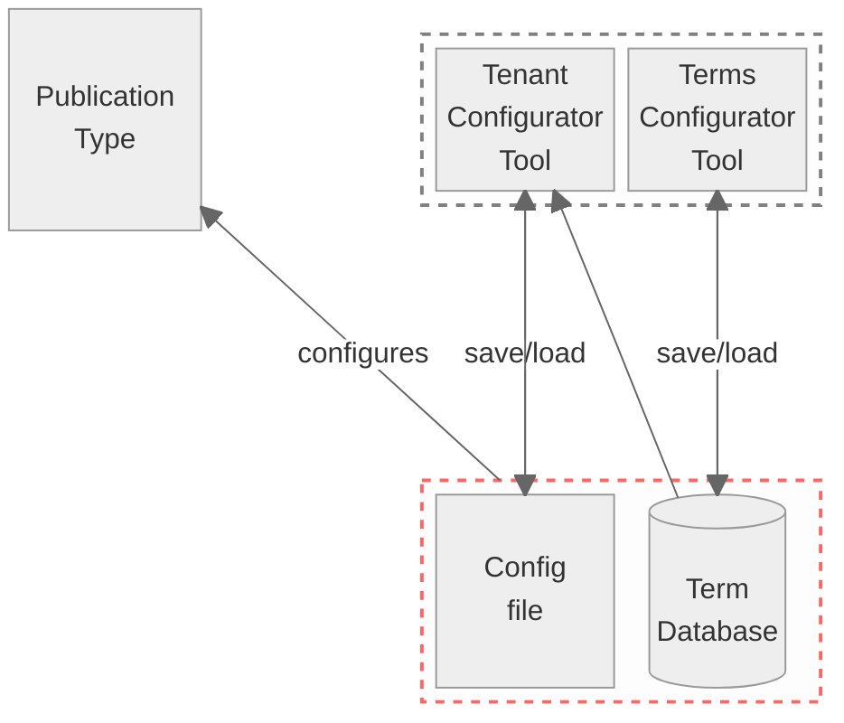

# The Publication Configuration Server

The publication configuration server is designed to deliver the configuration of client-specific publication types. It provides a REST API, which is used by the core software to supply the corresponding client-specific forms (Publication Types) at runtime.



${\color{red}----}$ Scope of this repository

${\color{grey}----}$ Out of scope (for the Publication Type Configurator see Repository [here](https://github.com/officialgazette/publication-configurator))

## API
Example of a tenant specific request

```
https://amtsblattportal.ch/terms/kabvs/AL-VS15
```
Structure of the tenant specific terms

https://github.com/officialgazette/publication-standard?tab=readme-ov-file#the-terminology-catalogue
## Boundary to the core software
